# The Taco Trailer
Developer: Jamie King

The Taco Trailer website has been developed to provide users the chance to order food for delivery or pick-up via a command line based interface. 

[View live website](https://taco-trailer.herokuapp.com/)

## Table of Contents

1. [Project Goals](#project-goals)
    1. [User Goals](#user-goals)
    2. [Site Owner Goals](#site-owner-goals)
2. [User Experience](#user-experience)
    1. [Target Audience](#target-audience)
    2. [User Requirements and Expectations](#user-requirements-and-expectations)
    3. [User Stories](#user-stories)
    4. [Site Owner Stories](#site-owner-stories)
    5. [User Manual](#user-manual)
3. [Technical Design](#technical-design)
    1. [Structure](#structure)
    2. [Flowchart](#flowchart)
    3. [Data Models](#data-models)
4. [Technologies Used](#technologies-used)
    1. [Coding Languages](#coding-languages)
    2. [Frameworks and Tools](#frameworks-and-tools)
    3. [Libraries](#libraries)
5. [Features](#features)
    1. [Existing Features](#existing-features)
    2. [Future Implementations](#future-implementations)
6. [Python Valiadation](#python-validation)
7. [Testing](#testing)
    1. [Device Testing](#device-testing)
    2. [Browser Compatibility](#browser-compatibility)
    3. [Manual Testing](#manual-testing)
    4. [Automated Testing](#automated-testing)
8. [Bugs](#bugs)
9. [Deployment](#deployment)
10. [Credits](#credits)
    1. [Tutorial](#tutorials)
    2. [Code](#code)
    3. [Literature](#literature)
    4. [Misc](#misc)
11. [Acknowledgements](#acknowledgements)

## Project Goals

### User Goals

- Be able to easily interact with the app to order food for pick up or delivery.
- Navigate the app seamlessly.
- Receive clear instructions on their current input options.
- Be provided with negative and postive feedback based on their inputs.
- Be able to remove items from an order or cancel the order prior to submission.
- The ability to create an account.
- The ability to change account password.

### Site Owner Goals

- Provide potential customers an easy to use app to order food from The Taco Trailer.
- Include an admin area in which information intended for staff only can be accessed. 
- As the site owner i wanted to secure the admin area of the app with a password.
- Have the ability to view previous orders that had been placed.
- Have the ability to view current pending orders that have yet to be picked up or delivered.
- Ensure all user inputs are validated and errors handled as to not provide issues with orders and a negative user experience.

## User Experience

### Target Audience

- People looking to have food ordered for delivery.
- People looking to pick up food from the store.

### User Requirements and Expectations

- The ability to seamlessly navigate through the app.
- To use an app that provides feedback to the user.
- To have validation that inputs have been successfully entered.
- Personalisation in the form of a user login with saved details.

### User stories

1. As a user, I want to be provided with clear instructions throughout the app.
2. As a user, I want to be able to create an account.
3. As a user, I want to be able to login/out of my account.
4. As a user, I want to be able to change my account password.
5. As a user, I want to be able to chose between order pick up or delivery.
6. As a user, I want to be able to change current order address if the stored one is incorrect.
7. As a user, I want to be able to view the menu.
8. As a user, I want to be able to add items to my order.
9. As a user, I want to be able to remove items from my order.
10. As a user, I want to be able to preview an order.
11. As a user, I want to be able to cancel an unplaced order.
12. As a user, I want to be able to place an order.
13. As a user, I want to be shown a receipt.
14. As a user, I want to be able to exit the app.

### Site Owner Stories

15. As the site owner, I would want users to be greeted with a welcome message to give a friendly feel to the app.
16. As the site owner, I would want to be able to access a password locked admin area.
17. As the site owner, I would want to be able to access all previous order records.
18. As the site owner, I would want to be able to access a list of pending orders.
19. As the site owner, I would want the registered users information to be saved to a google sheets file.
20. As the site owner, I would want orders to be saved to a google sheets file. 
21. As the site owner, I would want the user to get feedback in the case of invalid input.

### User Manual

Click here for app use instructions

#### Overview

The Taco Trailer app is for users who wish to place orders for delivery / collection and also for provding admin users with data from previous orders and pending orders.

#### Welcome Page

Purpose: To greet users.

Description: On the Welcome page users are asked if they would like to login / make an order. Users will be provdided with 2 options.

- Yes 
- No

Operation: User keyboard input. Selecting Yes will take the user to the Main Screen whilst selecting No will exit the app.

#### Main Page

Purpose: To provide users with a range of options.

Description: On the Main page users are be provdided with 4 options.

- Login 
- Create an account
- Continue as guest
- Return to main menu

Operation: User keyboard input.

##### Login
Operation: User keyboard input. Selecting the login option will direct users to the login page. Here they will be asked to enter their user name and password. Validation is used to validate that the user name entered is in The Taco Trailer Google Sheets database and that the entered password is correct. When successful the user will now be logged in and at the members area page, if an incorrect password is entered the user will be warned of an incorrect password input. Users have 3 guesses until the access denied message will show and the user is redirected back to the Welcome page. 

##### Create an account
Selecting the create an account option will guide users through the neccesary inputs required for creating an account. 

Those pieces of data are:

- Username
- Password
- First name
- Surname
- House number
- Street

Operation: User keyboard input. All forms of data use validation in which if data entered does not meet the requirements will display a warning message to the user. Once all data has been succcessfully entered the user will be made aware that new accounts can only be accessed upon restart of the app.

##### Continue as guest
Selecting the continue as guest will guide users through the neccesary inputs required for creating an order as a guest. 

Those pieces of data are:

- First name
- Surname
- Delivery option (Delivery or Collection)
- House number (If order is for delivery)
- Street (If order is for delivery)

All forms of data use validation in which if data entered does not meet the requirements will display a warning message to the user. Once all data has been succcessfully entered the user will then be directed to the menu in which they can then make selections via keyboard input (please refer to Menu section of manual for further details).

##### Return to main menu
Operation: User keyboard input. Selecting the return to main menu option will give users the opportunity to be redirect users back to the Welcome page.

#### Login

Purpose: To allow users to login and access the 'Members Area' of the app.

Description: Users will be asked for their user name and password. User inputs are as per below:

- Username - To be provided by the user to attempt login
- Password - To be provided by the user to login to a valid user name account.
- Q - To cancel login attempt

Operation: User keyboard input. Firstly user names will be validated against the list of users in the Google Sheets file. When that has been validated users will be asked to enter their password. If succesfull users will then be directed to the Members Area page, if password entry is incorrect users will be warned of this. Users have a total of 3 guesses before a login attempt is cancelled and the app will redirect back to the Welcome page.

#### Create Account

Purpose: To allow users to create an account with The Taco Trailer for future logins.

Description: Users will be asked to provide the neccesary data in order to create an account.

Those pieces of data are:

- User name
- Password
- First name
- Surname
- House number (If order is for delivery)
- Street (If order is for delivery)

Operation: User keyboard input. User names will be validated against the list of users in the Google Sheets file. If the user name is already in use, users will be made aware of this via a warning message. Upon chosing a valid username users will the be asked to provide a password which will be run through a validator. If unsuccesful, users will be asked to re enter a password, if successful users will be asked to re enter password to ensure the correct password desired was initially entered.

Users will then provide their first name, surname, house number and street. All of which will be run through validation and if do not meet the criteria users will be prompted to re enter the data. At any point users can cancel creating an account by pressing Q. At this point users will be provided with the option to confirm cancel or return to the current position in creating an account.

#### Admin Dashboard

Purpose: To allow Admins to access order records and view pending orders.

Description: On the Admin Dashboard page Admin users are provdided with 3 options:

- View records 
- View pending orders
- Exit admin dashboard

Operation: User keyboard input. Selecting View records will navigate to the View records page (see below View Records for further instructions on use), selecting View pending orders will navigate to the View pending orders page (see below View pending order for further instructions on use) and selecting Exit to admin dashboard will provide Admin users the ability to Log out and navigate back to the Welcome page. All options have validation for input and Exit admin dashboard provides an additional confirmation which if yes is selected will execute the exit and if no is selected the Admin user will stay on the Admin Dashboard.

##### View records

Purpose: To allow Admins to access all previously placed order records.

Description: On the View order page Admin users are asked to provide an order number to display.

Operation: User keyboard input. The Admin user will be instructed as to how many records exist and prompted to enter a record number. Upon a valid record entry input the record will be show and the Admin can continue to enter other record numbers or quit to the Admin Dashboard. If an invalid record number is entered the user is made aware of this via a warning prompt. User inputs are validated against the data available in the Google Sheets file.

##### Pending orders

Purpose: To allow Admins to access currently pending order.

Description: On the pending order page Admin users are shown what orders are currently pending. This is simulated to show all orders placed within the last 15 minutes are still pending delivery / collection.

Operation: User keyboard input. The Admin user will be shown all current pending orders, from this they have one option which is to exit and return back to the Admin Dashboard.

#### Menu

Purpose: To provde users with the range of items available for order and the ability to add/remove items, provide a preview of order and also complete/quit order.

Description: On the Menu page users are provided with a table format of the menu. Users will be provdided with 5 options.

- Item number will add the item of the input number to the order, users will be provided with feedback of which item has been added and also a warning message if an invalid input has been entered.
- R - Remove the last added item to the order. If there is no items currently in the order the user will be presented with an empty basket error message
- Q - To cancel order, view thank you message and return to the Welcome page. 
- P - To preview the current order.
- X - To complete order. This action can be cancelled at the next prompt stating if you are sure you want to complete the order, in which you will be directed back to the menu to continue adding / removing items.

Operation: User keyboard input. Initially the user will be provided with a tabulated version of the items available for ordering. At this point the user will be able to add items via entering the correct item number, remove items it there are items in the basket, preview the order, complete the order and continue to view the receipt or quit and cancel the order. All options use validation with users being provided with feedback both positive and negative. This will be displayed below the menu. 

## Technical Design

### Structure

This app was designed using Code Institutes Python Essentials Template. The template creates a command line interface within a blank page with a run button located above the command line interface. As this project is only intended for use on large screen devices there was no need to incorporate responsivness to the page. On arrival to the page, the user will be presented with a welcome message and instructions on user input choices. 

### Flowchart

A flowchart was created during the design process to help identify functions that would be required in the Python files.

Flow Chart

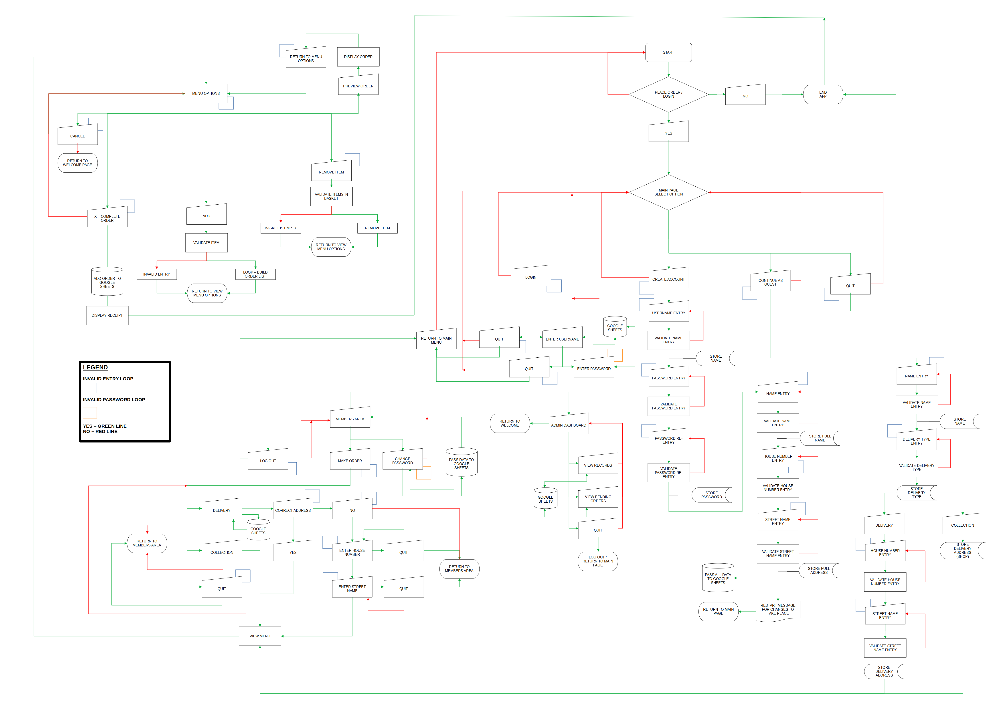

### Data Models

This project uses Object Orientated Programming to interact and manipulate the following:

- Classes - This project uses two classes. The first class called 'User' is used to create an instance of a new user based on inputs and append the details to a Google Sheets file. The second class called 'Order' is used to create an instance of an order based on inputs and then display the receipt of the order and append the order details to a Google Sheets file.
- Lists and dictionaries - This project uses list and dictionaries to aid the storage of data from the Google Sheets file to variables and vice versa. Using list comprehension dictionaries are used to validate if a new user name is not already, the user input for ordering an item exists and to store/view order records.
- Google Sheets API - Google Sheets was used in this project to store all required data outwidth the container and provide a level of security in user name and passwords.

## Technologies Used

### Coding Languages
- Python 3 - Used to create the command line based app.

### Frameworks and Tools
- Git - Used for version control.
- GitHub - Used to deploy the projects code.
- Gitpod - Used to develop and test code.
- LibreOffice Draw - Used to create the flowchart.
- Google Sheets - Used to store data outside of the program with the User data, food menu and sales records stored on seperate worksheets.
- Google Cloud Platform - Used to manage access permissions to google services such as google autho and google sheets.
- Heroku Platform - Used to deploy the live project.
- PEP8 - Used to validate code against Python conventions.

### Libraries

## Python Libraries

- os - Used to determine operating system and clear CLI.
- time - Used to create a delay effect.
- datetime - Used to get current time stamp and assign times to orders.
- getpass - Used to hide user input whilst entering passwords.

## Third Party Libraries

- tabulate - JUSTIFICATION: I used this library to output lists and dictionaries in a table format enhancing user experience and overall readability.
- termcolor - JUSTIFICATION: I used this library to give colour to user feedback and instructions
- pyfiglet - JUSTIFICATION: I used this library to generate the text art messages
- gspread - JUSTIFICATION: I used this library to add, remove and manipulate data within my Google Sheets worksheets and to interact with Google APIs
- google.oauth.service_account - JUSTIFICATION: I used this library to set up the authentication needed to access the Google API and connect the Service Account using the Credentials function. From this a cred.json file was generated with all details needed for the API to access the Google account. This information is then stored in the config var section when deploying to Heroku.

## Features

In its entirety the website consists of one main page, with a mock terminal within that page to run The Taco Trailer app.

### Existing features

#### Welcome message 

The welcome message is featured on the main page and will greet users with a friendly message.

Welcome message image

- Covered in user stories: 1 & 15

#### Welcome message invalid input feedback 

The welcome message invalid input feedback is featured welcome page and will alert users of an invalid option entry.

Welcome message invalid input image

- Covered in user stories: 1 & 21

#### Main page 

The main page is featured on the main page and displays 4 options for the user to pick from:
    - Login
    - Create and account
    - Continue as guest
    - Return to main menu

Main page image

- Covered in user story: 1

#### Login 

The login is featured on the main page and will prompt users for a valid user name to be entered followe by the password.

Login username image

Login password image

Login success image

- Covered in user stories: 1 & 3

#### Login - User name validation 

The login is featured on the main page and will prompt users for a valid user name to be entered.

Login prompt image

Invalid user name image

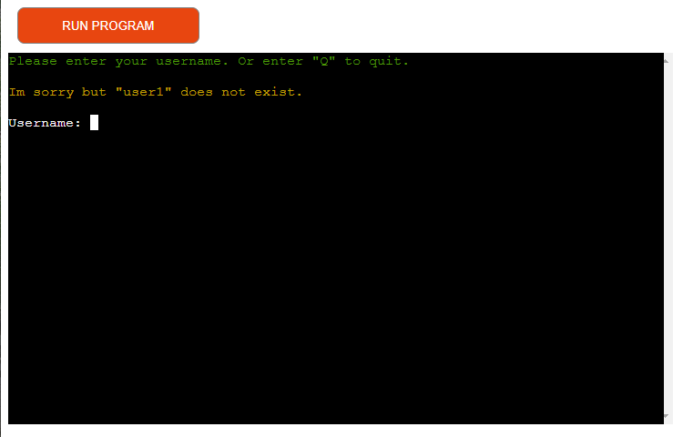

- Covered in user stories: 1, 3 & 21

#### Login - Password validation 

The login is featured on the main page and will prompt users for a valid user name to be entered.

Login image

Login password invalid image

- Covered in user stories: 1, 3 & 21

#### Members Area 

The Members area is a feature which will display a range of options for the user that is now logged in. It also includes a personalised Welcome message.

Members area image

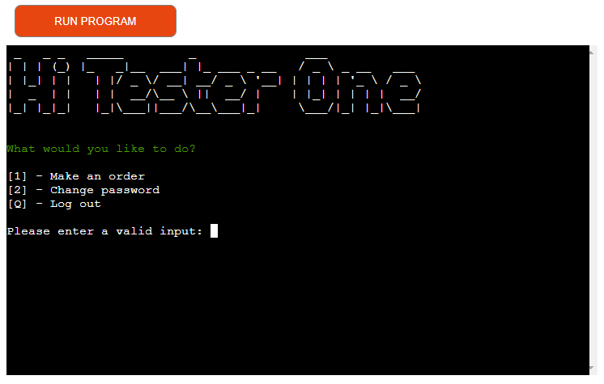

- Covered in user story: 1

#### Create order 

The create order feature will begin the process of creating an order. When logged in as a member this will prompt the user to enter their delivery type as name and address data has been taken from the Google Sheets file. For a guest the process to create an order will begin at providing a First name.

Create order (member) image

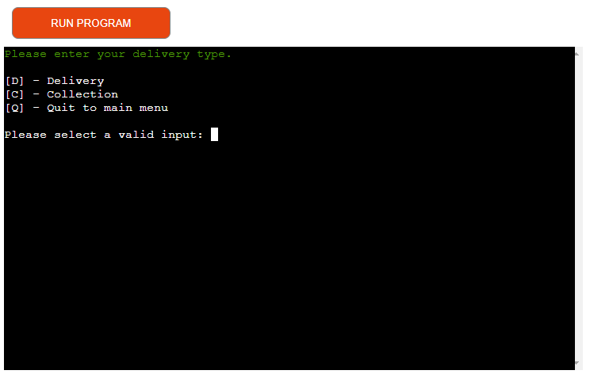

Create order (guest) image

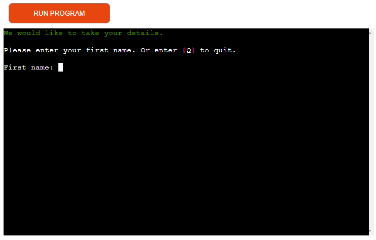

- Covered in user stories: 1 & 8

#### Member delivery options 

The member delivery options feature will allow logged in users to chose between Delivery or Collection. If Collection is selected then the Address on the order receipt will state 'The Taco Trailer'. If the user selects delivery they will be presented with the address data that they had entered when creating an account, this can be selected as correct and if not users will be prompted to enter a new delivery address for this order only, it will not update the database.

Member delivery order image

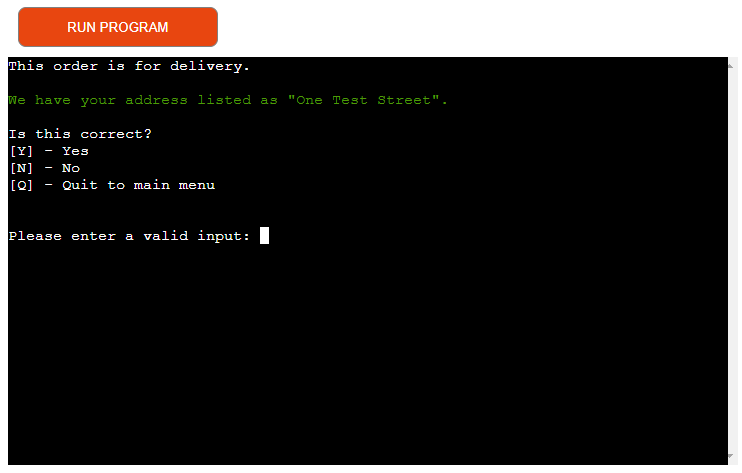

- Covered in user stories: 1, 5 & 6

#### Member change password 

The member change password feature will allow logged in users to change their password. Users must first confirm their current password and then enter a password which meets the criteria and then re enter to validate. Users will then made aware that password changes will only happen upon restart of the app.

Change password image

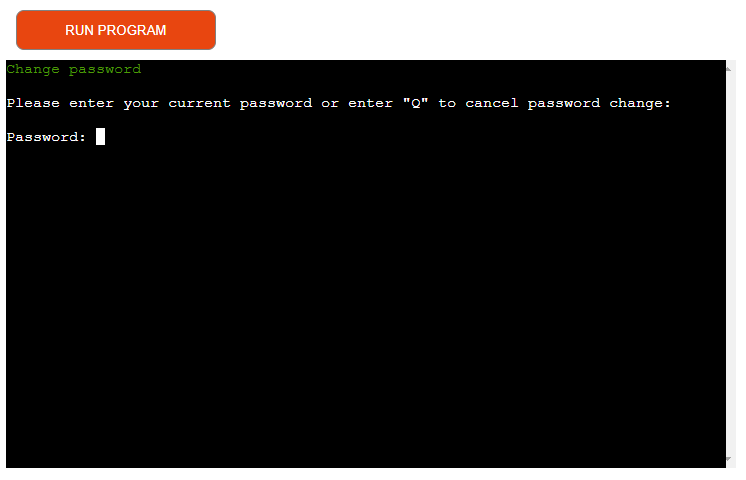

- Covered in user stories: 1 & 4

#### Member password update warning

The member password update warning feature will warn users that password changes will only happen upon restart of the app.

Password update warning image

- Covered in user stories: 1, 4 & 21

#### Admin Dashboard

The Admin Dashboard feature is a landing page which is only available for the Admin user. It features 2 option:
    - View order records
    - View pending order

Admin Dashboard image

- Covered in user story: 16

#### Admin - View order records

The Admin view order records feature allows Admin users to view all orders that have been created and stored in the Google Sheets 'Sales' worksheet.

View order records image

- Covered in user story: 17

#### Admin - View pending orders

The Admin view pending orders feature allows Admin users to view all currently pending orders that are stored in the Google Sheets 'Sales' worksheet.

View pending orders image

- Covered in user story: 18

#### Log out - Public user & Admin

The log out feature allows both public user or Admins to log out of their account and return to the Welcome page.

Log out image

- Covered in user stories: 1 & 3

#### Create account 

The create account is featured on the main page and will allow users to create an account with The Taco Trailer.

Create account image

- Covered in user stories: 1, 2 & 19

#### User name validation 

The user name validation is featured on the create account page and will parse the Google Sheets worksheet data to ensure user name is not already in use.

Create account enter user name image

User name taken error image

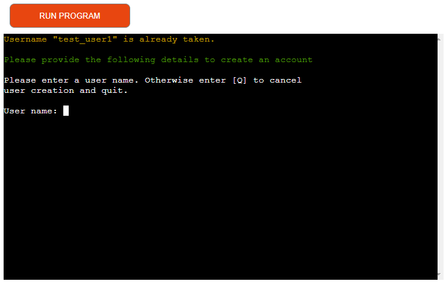

- Covered in user stories: 1, 2 & 21

#### Password creation validation 

The password validation is featured on the create account page and will ensure a password created.

Password creation image

Password creation error image

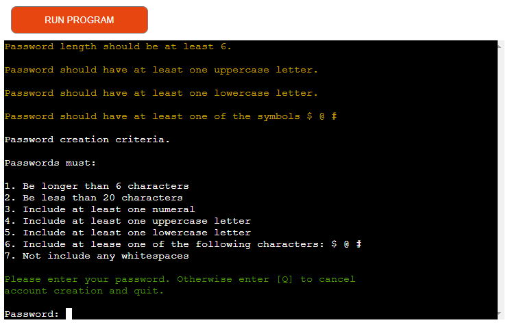

- Covered in user stories: 1, 2 & 21

#### First and surname validation 

The name validation feature is used to valid that both the first and surnames entered when creating an account do not contain special characters, nummbers or whitespace and if do prompts the user to re enter the data.

First name validation image

Surname validation image

- Covered in user stories: 1. 2 & 21

#### House number and Street name validation 

The house number and street name validation feature is used to valid that both the house number and address entered when creating an account. The house number is checked to make sure it does not contain special characters, characters or whitespace and if do prompts the user to re enter the data. The street name is checked to make sure it doesnt include numbers or special character.

House number validation image

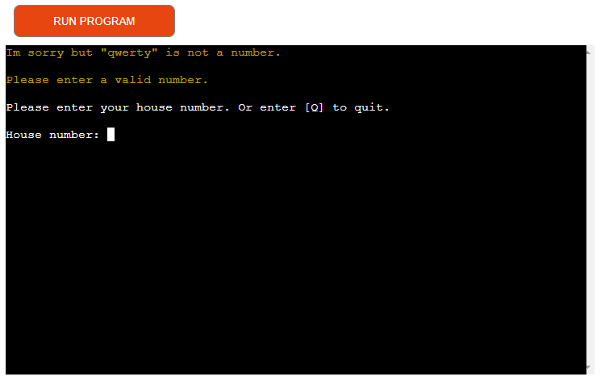

Street name validation image

- Covered in user stories: 1, 2 & 21

#### Account creation update warning

The account creation update warning feature will warn users that the account will only be accessible upon restart of the app.

Account creation update warning image

- Covered in user story: 1

#### Guest

The Continue as Guest is featured on the main page and will allow users to order without the need for logging into an account.

Guest login image

- Covered in user story: 1

#### Delivery Type option 

The delivery type option is featured when a member or guest creates an order. There are two choices, one being delivery and another of collection. Collection will auto populate the address as The Taco Trailer where as delivery will ask a guest for their address and for a member they will be prompted to confirm the details saved in their profile is where they would like this order to be delivered. If not, they will be prompted to enter the new delivery address.

Delivery type (member) image

Delivery type (member) "delivery" image

Delivery type (guest) image

- Covered in user stories: 1, 5 & 21

#### Collection option address 

The collection option featured will auto populate the delivery address for these orders as 'The Taco Trailer' and will be displayed on the order receipt.

Collection option address image

- Covered in user stories: 1 & 5

#### Menu 

The Menu featured will auto populate the delivery address for these orders as 'The Taco Trailer' and will be displayed on the order receipt.

Collection option address image

- Covered in user stories: 1 & 7

#### Add item to order 

The Add item to order feature on the Menu page allows users to add an item to their order by typing the relevant number as display on the menu.

Add item to order image

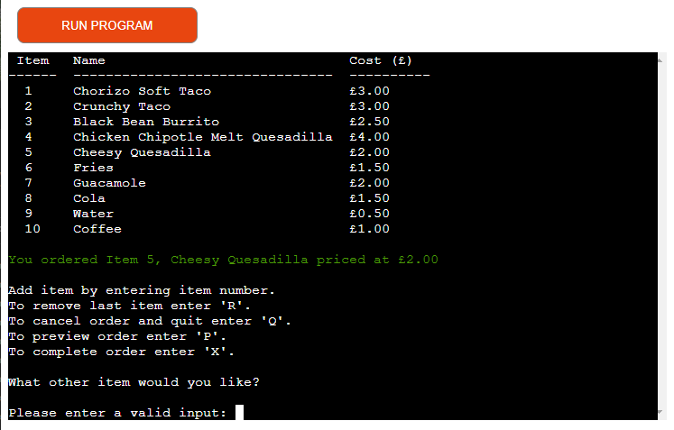

- Covered in user stories: 1 & 8

#### Invalid item from order 

The Invalid item feature on the Menu page warns users that their previously entered input is not valid.

Invalid item image

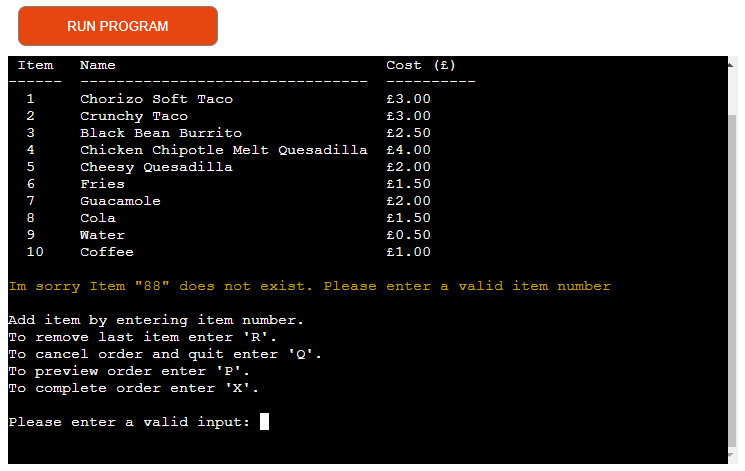

- Covered in user stories: 1 & 21

#### Remove item from order 

The remove item from order feature on the Menu page allows users to remove their last added item from their order. If their basket is empty, the user will be presented with a warning stating that the basket is currently empty.

Remove item image

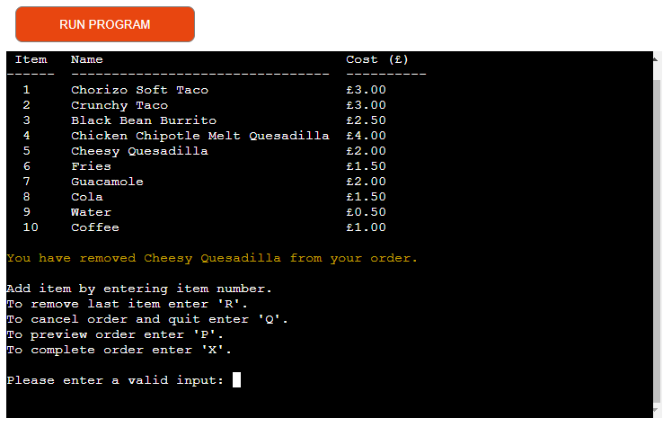

- Covered in user stories: 1 & 9

#### Empty basket warning 

The empty basket warning feature on the Menu page will warn users that their basket is empty, therefore no items can be removed.

Empty basket error image

- Covered in user stories: 1 & 21

#### Preview order 

The preview order feature on the Menu page allows users to preview the items currently added to their order.

Preview order image

- Covered in user stories: 1 & 10

#### Cancel order 

The cancel order feature on the Menu page allows users to cancel their order and return to the Welcome page.

Cancel order image

- Covered in user stories: 1 & 11

#### Delivery charge 

The delivery charge feature add a delivery cost if the order is for delivery and add nothing if it is for collection.

Delivery charge image

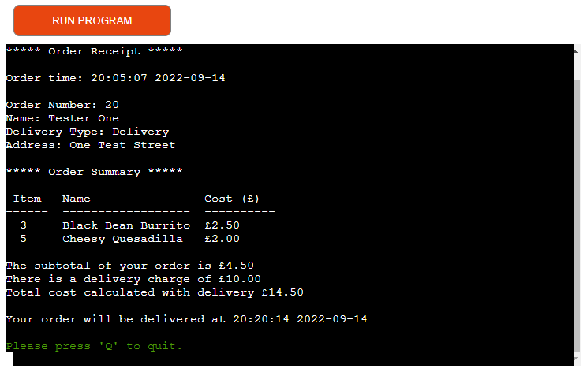

- Covered in user story: 1

#### Complete order 

The complete order is a feature that will allow users to complete and process the order or cancel and return to the menu and all of its options.

Complete order image

- Covered in user stories: 1, 12 & 20

#### Display order receipt 

The display order receipt featured will be displayed upon order completion. It includes all information which had been gathered throughout the process such as user name, name, address, delivery type and items order.

Display order receipt image

- Covered in user stories: 1 & 13

#### Quit 

The quit is a feature used throughout the app to allow the user to validate they do intend to quit and if not return to the current position in the app.

Quit image

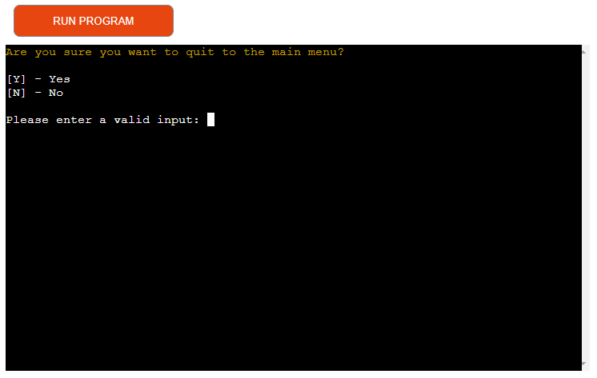

- Covered in user stories: 1 & 14

## Future implementations

In the future as my skills grow I would like to implement the following features:

- Ability to append the placed order to the users account row within google sheets and have a function to display all historical orders place by that logged in account
- Email address to be one of the required pieces of information when creating a user account so that the order receipt can be emailed to the user on completion via an Email API.

## Python Validation

[PEP-8 Validation](http://pep8online.com/) was used to validate the Python code used in the app. <>

Python file - run.py

Python file - order.py

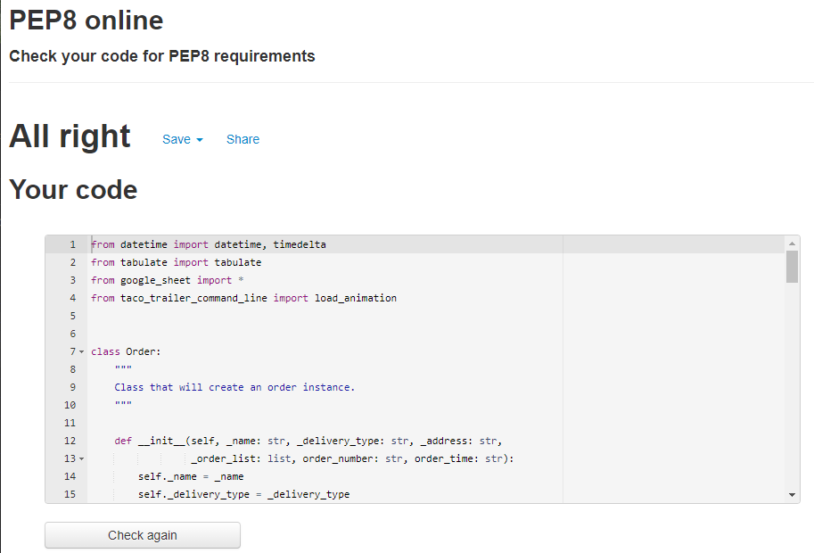

Python file - google_sheet.py

Python file - admin.py

Python file - taco_trailer_command_line.py

Python file - user.py

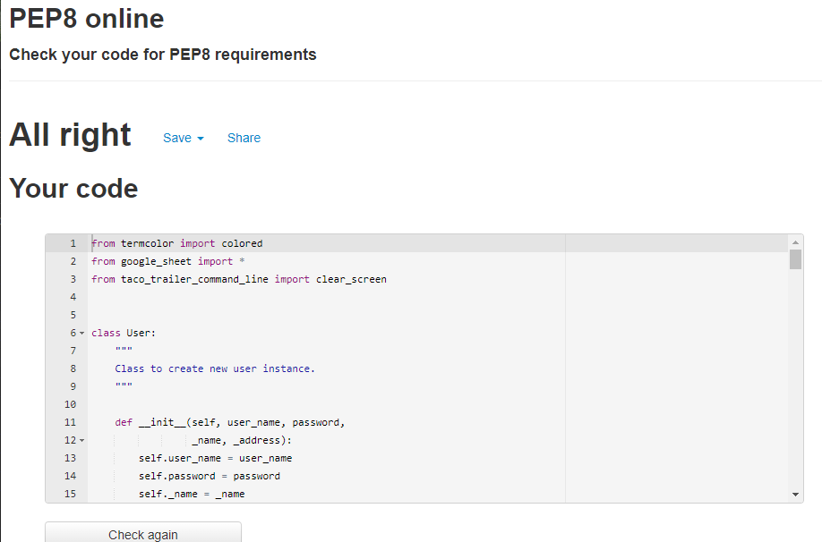

## Testing

### Device Testing

As this app is only intended to be used on desktops the website was tested on the following devices:
- Windows 10 PC with a 24" MSI Curved gaming monitor
- Raspberry Pi 4 with a 24" MSI Curved gaming monitor

### Browser Compatibility

The website was tested on the following web browsers:
- Google Chrome (Version 104.0.5112.102)
- DuckDuckGo

### Manual Testing

See Testing User Stories

#### Testing User Stories Users

1. As a user, I want to be provided with clear instructions throughout the app.

| Feature       | Action        | Expected Result  | Actual Result |
| ------------- | ------------- | -------------    | ------------- |
|  All listed features in the Features  |   |     |  |

Screenshots User Story 1

Feature - 

Feature - 

Feature - 

2. As a user, I want to be able to create an account.

| Feature       | Action        | Expected Result  | Actual Result |
| ------------- | ------------- | -------------    | ------------- |
| Create Account  | Select the create account option from the main page  | Create account process will begin with prompting for details   | Works as expected |
| Username Validation  | Enter desired user name when prompted  | Feedback to be displayed validating user name    | Works as expected |
| Password Validation  | Enter desired password when prompted  |  Feedback to be displayed validating password  | Works as expected |
| First / Surname Validation  | Enter desired First & Surname when prompted  | Feedback to be displayed validating First name and Surname   | Works as expected |
| House number / Street name Validation  | Enter desired House number & Street name when prompted  | Feedback to be displayed validating House number & Street Name   | Works as expected |

Screenshots User Story 2

Feature - 

Feature - 

Feature - 

Feature - 

Feature - 

3. As a user, I want to be able to login/out of my account.

| Feature       | Action        | Expected Result  | Actual Result |
| ------------- | ------------- | -------------    | ------------- |
| Login | Navigate to the log in section and select log in | Log in screen to ask for credentials | Works as expected |
| Login User name validation | To enter user name when prompted | Feedback to be displayed validating user name | Works as expected |
| Login Password validation | To enter password when prompted | Feedback to be displayed validating password and account to log in |Works as expected  |
| Log out | To select the log out option from the members or admin page | Prompt to user to confirm log out and then log out and return to Welcome page | Works as expected |

Screenshots User Story 3

Feature - 

Feature - 

Feature - 

Feature - 

4. As a user, I want to be able to change my account password.

| Feature       | Action        | Expected Result  | Actual Result |
| ------------- | ------------- | -------------    | ------------- |
| Member change password  |  Navigate to the member change password | To be prompted to enter current password, once validated be prompted to enter new password and re enter to confirm | Works as expected  |
| Member password update warning | Update password | Feedback to display warning message that password change will only occur on restarting the app |Works as expected  |

Screenshots User Story 4

Feature - 

Feature - 

Feature - 

Feature - 

5. As a user, I want to be able to chose between order pick up or delivery.

| Feature       | Action        | Expected Result  | Actual Result |
| ------------- | ------------- | -------------    | ------------- |
| Member delivery option  | Log in and create an order and select delivery type | To be prompted to enter delivery option    | Works as expected |
| Delivery type option  | As a guest begin an order and after entering First name and surname choose delivery type  | Display delivery types and be able to pick from Delivery or Collection  |Works as expected  |
| Collection option address  | Select collection as delivery option | App to auto populate the address as The Taco Trailer in the receipt    |Works as expected  |

Screenshots User Story 5

Feature - 

Feature - 

Feature - 

6. As a user, I want to be able to change current order address if the stored one is incorrect.

| Feature       | Action        | Expected Result  | Actual Result |
| ------------- | ------------- | -------------    | ------------- |
| Member delivery option  | When choosing delivery type, select delivery but when prompted if current address is correct select no  | User to be prompted with entering house number and street name | Works as expected |

Screenshots User Story 6

Feature - 

7. As a user, I want to be able to view the menu.

| Feature       | Action        | Expected Result  | Actual Result |
| ------------- | ------------- | -------------    | ------------- |
| Menu  | Enter all user credentials to gain access to the menu  | Menu and options to be displayed to the user  | Works as expected |

Screenshots User Story 7

Feature - 

8. As a user, I want to be able to add items to my order.

| Feature       | Action        | Expected Result  | Actual Result |
| ------------- | ------------- | -------------    | ------------- |
| Add item to order  | From the menu page enter a valid number to add that item to the basket | Item to be added to the basket and feedback to be provided  |Works as expected |

Screenshots User Story 8

Feature - 

9. As a user, I want to be able to remove items from my order.

| Feature       | Action        | Expected Result  | Actual Result |
| ------------- | ------------- | -------------    | ------------- |
| Remove item  | From the menu page enter R  | Last added item to be removed from order and feedback provided to confirm this | Works as expected  |

Screenshots User Story 9

Feature - 

10. As a user, I want to be able to preview an order.

| Feature       | Action        | Expected Result  | Actual Result |
| ------------- | ------------- | -------------    | ------------- |
| Preview order | From the menu page enter P | Order preview to display all added items to the basket   | Works as expected |

Screenshots User Story 10

Feature - 

11. As a user, I want to be able to cancel an unplaced order.

| Feature       | Action        | Expected Result  | Actual Result |
| ------------- | ------------- | -------------    | ------------- |
| Cancel order  | From the menu page press Q  | Be prompted to confirm user would like to quit to Welcome page and cancel order  |Works as expected  |

Screenshots User Story 11

Feature - 

12. As a user, I want to be able to place an order.

| Feature       | Action        | Expected Result  | Actual Result |
| ------------- | ------------- | -------------    | ------------- |
| Complete order  | From the menu page press X  | Be prompted to confirm if the user would like to complete the order or return to the menu   | Works as expected |

Screenshots User Story 12

Feature - 

13. As a user, I want to be shown a receipt.

| Feature       | Action        | Expected Result  | Actual Result |
| ------------- | ------------- | -------------    | ------------- |
| Display receipt  | Complete an order  | Upon order completion a formatted page of order summary will be shown   | Works as expected |

Screenshots User Story 13

Feature - 

14. As a user, I want to be able to exit the app.

| Feature       | Action        | Expected Result  | Actual Result |
| ------------- | ------------- | -------------    | ------------- |
|   Quit   |  Press Q at the receipt page  | App to exit upon user entering Q     |Works as expected  |

Screenshots User Story 14

Feature - 

#### Site Owner

15. As the site owner, I would want users to be greeted with a welcome message to give a friendly feel to the app.

| Feature       | Action        | Expected Result  | Actual Result |
| ------------- | ------------- | -------------    | ------------- |
|  Welcome message    | Run the app   |  Welcome message to be displayed    |Works as expected  |

Screenshots User Story 15

Feature - 

16. As the site owner, I would want to be able to access a password locked admin area.

| Feature       | Action        | Expected Result  | Actual Result |
| ------------- | ------------- | -------------    | ------------- |
|   Admin Dashboard   |  Login as Admin  | After successful Admin login, Admin will be displayed the Admin Dashboard     |Works as expected  |

Screenshots User Story 16

Feature - 

17. As the site owner, I would want to be able to access all previous order records.

| Feature       | Action        | Expected Result  | Actual Result |
| ------------- | ------------- | -------------    | ------------- |
|  View order records   |  From the Admin Dashboard select the option to view order records  | Admin to be displayed with page stating how many records are available  |Works as expected  |

Screenshots User Story 17

Feature - 

18. As the site owner, I would want to be able to access a list of pending orders.

| Feature       | Action        | Expected Result  | Actual Result |
| ------------- | ------------- | -------------    | ------------- |
|   View pending orders   |    |      |Works as expected  |

Screenshots User Story 18

Feature - 

19. As the site owner, I would want the registered users information to be saved to a google sheets file.

| Feature       | Action        | Expected Result  | Actual Result |
| ------------- | ------------- | -------------    | ------------- |
|  Create account    |  From the Admin Dashboard select the option to view pending order  |   Admin to be displayed with page indicating all pending orders if there are any   |Works as expected  |

Screenshots User Story 19

Feature - 

20. As the site owner, I would want orders to be saved to a google sheets file.

| Feature       | Action        | Expected Result  | Actual Result |
| ------------- | ------------- | -------------    | ------------- |
| Complete order receipt     |  Users input and complete orders  |  For each order submitted by a user, all information entered during this process will be appended to a google sheets worksheet    | Works as expected |

Screenshots User Story 20

Feature - 

21. As the site owner, I would want the user to get feedback in the case of invalid input.

| Feature       | Action        | Expected Result  | Actual Result |
| ------------- | ------------- | -------------    | ------------- |
| Welcome message invalid feedback     |  User enters incorrect input  |      |Works as expected  |
| Login username validation     |  User enters user name  |      |Works as expected  |
| Login Password validation     | User enters password   |      | Works as expected |
| Member password update warning     |  Member to update password  | Upon successful password change, user will be displayed warning that password change will only take effect upon restart of the app     | Works as expected |
| Username validation    | Memeber to attempt to sign in with user name   | User to be prompted      |Works as expected  |
| Password creation validation     |  User to enter a desired password when creating an account  | User to be provided with feedback based on password validation | Works as expected |
| First / surname validation     | User to enter a desired First name and Surname when creating an account   |  User to be provided with feedback based on name validation    | Works as expected |
| House number / Street name validation     |  User to enter a desired House number and Street when creating an account  |  User to be provided with feedback based on House number and Street name validation    | Works as expected |
| Delivery Type option     | User to chose a delivery type   | User to be provided with feedback stating chosen delivery type | Works as expected |
| Invalid item     | User to enter a wrong item number on the menu page   | User to be provided with feedback stating there was an error in their recent entry     |Works as expected  |
| Empty basket     | User to try and remove an item from an empty basket   |  User to be provided with feedback stating there was an error due to their basket being empty    |Works as expected |

Screenshots User Story 21

Feature - 

Feature - 

Feature - 

Feature - 

Feature - 

Feature - 

Feature - 

Feature - 

Feature - 

Feature - 

Feature - 

### Automated Testing

See unit testing

Using Pythons unittest library i wrote a unit test to test for correct operation of users entering passwords.

A new test file was created and imported the unittest library and also the taco_trailer_command_line module as it is where the function to be tested originates from.

One test function to test for valid user input and one test function to test for invalid user input was created. 

The test ran and was successful.

Unit testing Code

Unit testing Result

## Bugs

During the project i encountered a number of bugs some of which were solved some of which were not as stated below:

| Bug           | Fix           |
| ------------- | ------------- |
| Pending orders ignoring the date and only checking for difference in time ie if a previous days order time was within 15 minutes of the current time it would display  | Discussions with CI Tutor Support led to looping through the list generated from google sheets, adding a new key with the values to be the string time converted to datetime. This then took the date into account and fixed the issue. |
| Input order number when ordered was incorrect due to indexing | Food order variable which stores the input from the user had 1 added to display the correct item | 
| Item number input would allow item 0 to be ordered and would select the last item. This was due to -1 from user input to fix the indexing issue would the allow a value of -1 whch then translates to the last item in the list  | A second condition in the if statement to check if the user input is greater than 0. |
| IndexError when removing item when order list is empty   | try and except  block added to handle the error in an elegant fashion |
| When viewing in deployed heroku app, print receipt will not clear from screen  | This issue only occurs within the Heroku deployed app. As this is a Heroku issue outwith my own control i have resulted in documenting this as a known bug which cannot be fixed. |
| Application must be restarted in order to use newly created user account  | As the module needs to reload i have yet to find a fix for this without restarting the application, this has been documented as a known bug. |
| Application must be restarted in order to use changed password | As the module needs to reload i have yet to find a fix for this without restarting the application, this has been documented as a known bug.|

## Deployment

### Heroku

This project was deployed to Heroku in the project's early stages to allow continual responsive testing. This was achieved via the following steps:

The website was deployed using Heroku by "following these steps:

1. Use the "pip freeze -> requiremnts.txt" command in the terminal to save any libraries that need to be installed in the file.
2. Navigate to https://www.heroku.com/ and login or create an account. 
3. Click the "new" button in the upper right corner and select "create new app".

Screenshot

4. Choose an app name and your region and click "Create app".

Screenshot

5. Under Config Vars store any sensitive data you saved in .json file. Name 'Key' field, copy the .json file and paste it to 'Value' field. Also add a key 'PORT' and value '8000'.

Screenshot

6. Go to the "settings" tab, add the Python build pack and then the node.js build pack (please note they need to be in the correct order of Python above node.js).

Screenshot

Screenshot

Screenshot

7. Go to the "deploy" tab and pick GitHub as a deployment method.
8. Search for a repository to connect to and select the branch you would like to build the app from.
9. If preferred enable automatic deploys and then deploy branch.
10. Wait for the app to build and then click on the "View" link which will redirect you to the deployed link.

### Forking the GitHub Repository

We can make a copy of the original repository on our GitHub account to view or make changes too without affecting the original repository, this is known as forking. Forking in GitHub can be done via the following steps:

1. Navigate to www.github.com and log in.
2. Once logged in navigate to the desired [GitHub Repository](https://github.com/jkingportfolio/CI_PP3_Taco_Trailer) that you would like to fork.
3. At the top right corner of the page click on the fork icon.
4. There should now be a copy of your original repository in your GitHub account.

Please note if you are not a member of an organisation on GitHub then you will not be able to fork your own repository.

### Clone a GitHub Repository

You can make a local clone of a repository via the following steps: 

1. Navigate to www.github.com and log in.
2. Once logged in navigate to the desired [GitHub Repository](https://github.com/jkingportfolio/CI_PP3_Taco_Trailer) that you would like to clone.
3. Locate the code button at the top, above the repository file structure.
4. Select the preferred clone method from HTTPS. SSH or GitHub CLI then click the copy button to copy the URL to your clipboard.
5. Open Git Bash
6. Update the current working direction to the location in which you would like the clone directory to be created.
7. Type `git clone` and paste the previously copied URL at Step 4.
8. `$ clone https://github.com/jkingportfolio/CI_PP3_Taco_Trailer`
9. Now press enter and the local clone will be created at the desired local location

## Credits

### Tutorials

- A tutorial on the use of Pythons next function was used for learning a new way of iterating the user names stored in the Google Sheets worksheet - [Pythons next() function](https://www.w3schools.com/python/ref_func_next.asp)
- The gspread documentation was used to aide reading and writing data to the Google Sheet - [Gspread documentation](https://docs.gspread.org/en/latest/)
- A tutorial on the use of the tabulate module for displaying table data from pyeng.io was used - [Tabulate](https://pyneng.readthedocs.io/en/latest/book/12_useful_modules/tabulate.html)
- A tutorial on the use of getpass() was used to allow password input to be hidden. This article was from geeksforgeeks.org - [getpass()](https://www.geeksforgeeks.org/getpass-and-getuser-in-python-password-without-echo/#:~:text=The%20getpass()%20function%20is,the%20caller%20as%20a%20string.)

### Code

 Code from external sources were used as a basis and built on top of in this project, they are credited below:

 - Code to Validate a password was taken from an article on geeksforgeeks.org - [Password Validation](https://www.geeksforgeeks.org/password-validation-in-python/)
 - Code Institute student support was used to help tackle the issue in my code when comparing time and date strings
 - Code from codegrepper.com was used to help understand how to remove milliseconds from datetime timestamps - [Remove milliseconds](https://www.codegrepper.com/code-examples/python/remove+milliseconds+from+datetime+python)

### Literature

The use of reference books were used throughout the creation of this project and are credited below:

- Python Crash Course by Eric Matthes, published by No Startch Press
- Learn Python Programming by Fabrizio Romano & Heinrich Kruger, published by Packt Publishing
- Python Object-Orientated Programming - Fourth Edition by Steven F. Lott & Dusty Phillips, published by Packt Publishing

### Misc

The source of where I learned how to produce a GitHub fork and clone was from the following pages of the GitHub Documentation. Although I did not use a fork or clone in this project it is something I hope to implement to future projects now I have the knowledge to do so.

- https://docs.github.com/en/get-started/quickstart/fork-a-repo
- https://docs.github.com/en/repositories/creating-and-managing-repositories/cloning-a-repository

## Acknowledgements

I would like to also thank the following:
- My wife and family for their support and feedback whilst doing this project
- My fellow Code Institute students whom i have bounced ideas and problems back and forth with via Slack
- [Carina Browning](https://github.com/carinaAJ) for testing and providing feedback through out the project
- Code Institute tutor support who helped with an issue i had with iteration of list of dictionaries.
- My Code Institute mentor Mo Shami for his guidance through this project.